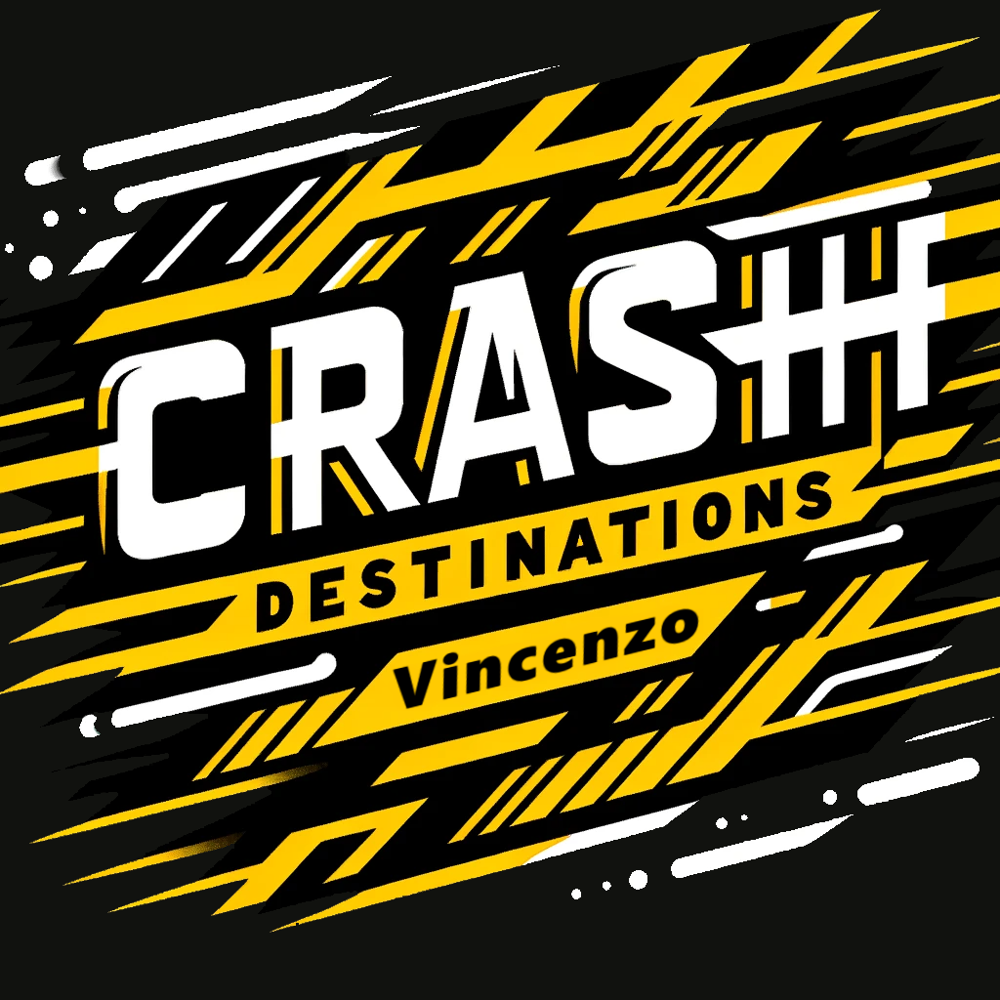

  

# CRASH-DEST!

Pagina per un sito di viaggi fatta come esercizio giornaliero durante il corso fullstack Epicode, interpretato con quel flavour che mi contraddistingue

## Tecniche

-  **HTML** - Il buon vecchio HTML5 per la struttura
-  **JavaScript** - Ho realizzato un metodo che legge la data corrente e ne sorteggia un'altra, modifica il testo dell'offerta del giorno e calcola quanto tempo rimane
-  **BOOTSTRAP** - Tutto il layout è completamente responsive grazie alle classi bootstrap
-  **CSS3** - Usato per limare bootstrap e animare la scritta a festa nel pannello offerta del giorno

## Risorse

-  **DALL-E** - Ho usato DALL-E per realizzare alcuni asset grafici
-  **CDNFonts** - Font forniti da CDNFonts

Link: https://vikappa.github.io/D2---W2---U2/
