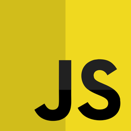

  

# CRASH-DEST!

Pagina per un sito di viaggi fatta come esercizio giornaliero durante il corso fullstack Epicode, interpretato con quel flavour che mi contraddistingue

## Tecniche

-  **HTML** - Il buon vecchio HTML5 per la struttura
-  **JavaScript** - Ho realizzato un metodo che legge la data corrente e ne sorteggia un'altra, modifica il testo dell'offerta del giorno e calcola quanto tempo rimane
-  **BOOTSTRAP** - Tutto il layout è completamente responsive grazie alle classi bootstrap
-  **Syntatically Awesome Style Sheet ** - Ho usato sass per modificare il framework bootstrap e aggiungere le classi responsive per modificare i bordi che non esistono di default come rounded-lg-3 o rounded-sm-circle
(nota: le nuove classi BS custom non funzionano in combinazione con quelle default, quindi "rounded-4 rounded-lg-pill" non funziona, ma "rounded-sm-4 rounded-lg-pill" si)

## Risorse

-  **DALL-E** - Ho usato DALL-E per realizzare alcuni asset grafici
-  **CDNFonts** - Font forniti da CDNFonts
-  **BootSnip** - Snippet per il multi-item carousel rubato da https://codepen.io/hellomev/pen/LYORMQW

Link: https://vikappa.github.io/D2---W2---U2/
